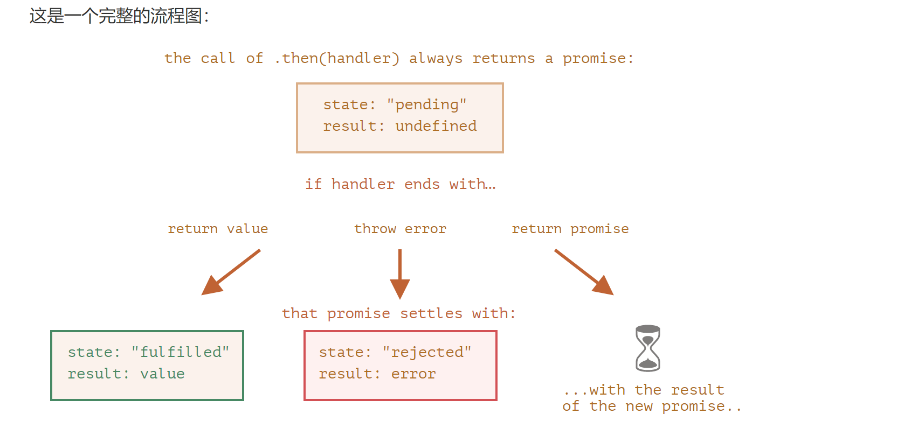

# promise 链

* 当我们有一系列的异步任务需要一个接一个执行时

```javascript
new Promise((resolve, reject) => {
  setTimeout(resolve(1), 1000); // (*)
}).then((result)=> { // (**)
  alert(result); // 1
  return result * 2
}).then(result=> { // (***)
  alert(result); // 2
  return result * 2
}).then(result=> {
  alert(result); // 4
  return result * 2
})
```
* 它可以通过.then处理程序(handler)链进行传递result
1. 初始promise 在1秒后resolve (*)
2. .then程序被调用(**), 它又创建一个新的promise(以2作为值)
3. 下一个 then (***) 得到了前一个 then 的值，对该值进行处理（*2）并将其传递给下一个处理程序。

* 当处理程序返回一个值时, 它将该promise的result, 所以使用它调用下一个then

> 把多个.then添加到一个promise上, 但是这不是promise链

```javascript
let promise = new Promise(function(resolve, reject) {
  setTimeout(() => resolve(1), 1000);
});

promise.then(function(result) {
  alert(result); // 1
  return result * 2;
});

promise.then(function(result) {
  alert(result); // 1
  return result * 2;
});

promise.then(function(result) {
  alert(result); // 1
  return result * 2;
});
```
在同一个 promise 上的所有 .then 获得的结果都相同 —— 该 promise 的结果。所以，在上面的代码中，所有 alert 都显示相同的内容：1。

## 返回promise

`.then(handler)`中使用的处理程序(handler)可以创建并返回一个promise

```javascript
// 如果在以下.then中把resolve修改为reject, .then后面都不会再被执行了
new Promise(function(resolve, reject) {

  setTimeout(() => resolve(1), 1000);

}).then(function(result) {

  alert(result); // 1

  return new Promise((resolve, reject) => { // (*)
  // 如果改成 reject('失败了'), 下面都不会再被执行了
    setTimeout(() => resolve(result * 2), 1000);
  });

}).then(function(result) { // (**)

  alert(result); // 2

  return new Promise((resolve, reject) => {
    setTimeout(() => resolve(result * 2), 1000);
  });

}).then(function(result) {

  alert(result); // 4

});
```


#### 更复杂的例子

```javascript
fetch('/article/promise-chaining/user.json')
  // 将其加载为 JSON 拿到user
  .then(response => response.json())
  // 发送一个到 GitHub 的请求 根据user.name获取user的信息
  .then(user =>  fetch(`https://api.github.com/users/${user.name}`))
  // 将响应加载为 JSON 获取到的user的信息
  .then(response => response.json())
  // 显示头像图片（githubUser.avatar_url）3 秒（也可以加上动画效果）
  .then(githubUser => {
    let img = document.createElement('img');
    img.src = githubUser.avatar_url;
    img.className = "promise-avatar-example";
    document.body.append(img);

    setTimeout(() => img.remove(), 3000); // (*)
  });
```
------
* 为了使链可扩展, 需要在头像显示结束时进行resolve的promise

```javascript{5,13}
fetch('/article/promise-chaining/user.json')
  .then(response => response.json())
  .then(user => fetch(`https://api.github.com/users/${user.name}`))
  .then(response => response.json())
  .then(githubUser => new Promise(function(resolve, reject) { // (*)
    let img = document.createElement('img');
    img.src = githubUser.avatar_url;
    img.className = "promise-avatar-example";
    document.body.append(img);

    setTimeout(() => {
      img.remove();
      resolve(githubUser); // (**)
    }, 3000);
  }))
  // 3 秒后触发
  .then(githubUser => alert(`Finished showing ${githubUser.name}`));

/**
 * 在第(*)行的.then处理程序返回一个new Promise,只有在 setTimeout 中的 resolve(githubUser) (**) 被调用后才会变为 settled。链中的下一个 .then 将一直等待这一时刻的到来。
 */
```

* 将代码拆分为可重用的函数

```javascript
function loadJson(url) {
  return fetch(url).then(res=> res.json())
}

function loadUser(name) {
  return loadJson(`https://api.github.com/users/${name}`)
}

function showAvatar(user){
  return new Promise((resolve,reject) => {
    let img = document.createElement('img');
    img.src = user.avatar_url;
    img.className = "promise-avatar-example";
    document.body.append(img);

    setTimeout(()=> {
      img.remove();
      resolve(user)
    }, 3000)
  })
}

// 使用他们

loadJson('/article/promise-chaining/user.json')
.then(user=>loadUser(user.name))
.then(user=> showAvatar(user))
.then(userData=> alert(`加载完成`))
```

### 总结

如果.then(或 catch/finally)处理程序返回一个promise, 其余的链将等待,那么链的其余部分将会等待，直到它状态变为 settled(状态为成功或者失败)。当它被 settled 后，其 result（或 error）将被进一步传递下去。
