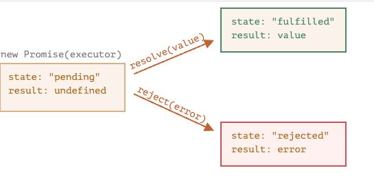
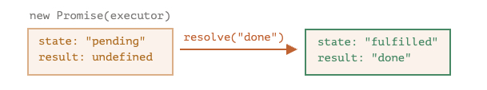
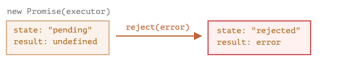

# Promise

## Promise与真实生活的对比

1. "生产者代码" 会做一些事情，并且会需要一些事件。例如, 通过网络加载数据
2. "消费者代码" 想要再"生产者代码"完成工作的第一个事件就能获取其成果, 许多函数可能都需要照顾结果
3. __promise__ 是将 "生产者代码" 和 "消费者代码" 连接在一起的一个特殊JavaScript对象

* promise对象的构造器(constructor) 语法:

```javascript
let promise = new Promise((resolve, reject) => {
  // executor (生产者代码)
})
```

* 传递给 `new Promise`的函数被称为 __executor__。当new Promise 被创建时，executor会被自动运行，它包含最终应产出结果的生产者代码
* 它的参数 `resolve` 和 `reject` 是由 JavaScript本身提供的回调, 我们的代码仅在 executor 的内部
* 当`executor`获得了结果, 无论是早还是晚, 都应该调用下列回调之一
  1. resolve(value) - 如果任务成功完成并带有结果
  2. reject(error) -  error即为error对象
  
------

由 `new Promise`构造器返回的promise 对象具有以下内部属性

1. state - 最初是`pending`, 然后再`resolve`被调用时变成 `fulfilled`, 或者在`reject`调用时变成`rejected`
2. result - 最初是 `undefined`, 然后再 `resolve(value)` 被调用时成为`value`, 或者在`reject(error)` 变成 `error`



### 一个成功的例子

```javascript
// 一个promise 构造器和一个简单的executor函数
let promise = new Promise((resolve, reject)=> {
  setTimeout(() => {
    resolve('done')
  }, 1000);
})
```

发生了两件事

1. executor被自动且立即调用 (通过 new Promise)
2. executor接受两个参数: resolve 和 reject



------

### 一个失败的例子

```javascript
let promise = new Promise(function(resolve, reject) {
  // 1 秒后发出工作已经被完成的信号，并带有 error
  setTimeout(() => reject(new Error("Whoops!")), 1000);
});
```



executor 应该执行一项工作, 然后调用resolve和reject来改变promise对象的状态

与最初的 “pending” promise 相反，一个 resolved 或 rejected 的 promise 都会被称为 “settled”。

------

__只能有一个结果或一个error__

```javascript
let promise = new Promise(function(resolve, reject) {
  resolve("done");

  reject(new Error("…")); // 被忽略
  setTimeout(() => resolve("…")); // 被忽略
});
```

__resolve或reject可以立即进行__

实际上, executor通常是异步执行某些操作, 并在一段时间后调用 resolve/rejected, 但这不是必须的, 也可以立即调用

```javascript
let promise = new Promise((resolve, reject)=> {
  resolve(123)
})
```

__state和result都是内部的__

Promise 对象的 state 和 result 属性都是内部的。我们无法直接访问它们。但我们可以对它们使用 .then/.catch/.finally 方法。我们在下面对这些方法进行了描述。

## 消费者: then, catch

Promise 对象充当的是 executor（“生产者代码”）和消费函数之间的连接，后者将接收结果或 error。可以通过使用 .then 和 .catch 方法注册消费函数。

### .then
```javascript
promise.then(
  function (result) { },
  function (error) {}
)
```
.then的第一个参数是一个函数, 该函数将在promise resolved 接收到结果后执行
.then的第二个参数也是一个函数, 该函数将在promise rejected 接受到error信息后执行

```javascript{8}
// 成功的案例
let promise = new Promise(function(resolve, reject) {
  setTimeout(() => resolve("done!"), 1000);
});

// resolve 运行 .then 中的第一个函数
promise.then(
  result => alert(result), // 1 秒后显示 "done!"
  error => alert(error) // 不运行
);

// 如果我们只对成功完成有后处理, 可以只为.then提供一个函数参数
let promise = new Promise(resolve => {
  setTimeout(() => resolve("done!"), 1000);
});

promise.then(alert); // 1 秒后显示 "done!"

```

### catch
如果我们只对error感兴趣, 可以使用null作为第一个参数：.then(null, errorHandlingFunction)。或者我们也可以使用 .catch(errorHandlingFunction)

```javascript{8}
let promise = new Promise((resolve, reject) => {
  setTimeout(() => reject(new Error("Whoops!")), 1000);
});

// .catch(f) 与 promise.then(null, f) 一样
promise.catch(alert); // 1 秒后显示 "Error: Whoops!"

// catch(f) 调用是 .then(null, f) 的完全模拟, 它只是一个简写形式
promise.then(null, f=> {
  // f是传进来的error信息
  console.log(f); // Error("Whoops!")
})
```

## 清理: finally

作用: 无论 promise 被 resolve 还是 reject。都会执行finally

* finally 的功能是设置一个处理程序在前面的操作完成后, 执行清理/终结
  - 如: 停止加载指示器，关闭不再需要的连接等

__finally(f)__ 并不完全是 then(f,f)的别名

它们之间的区别:

  1. finally处理程序 (handler) 没有参数, 在finally中, 不知道 promise 是否成功. 但是finally的任务是执行"常规"的完成程序
  2. finally处理程序将结果或error '传递'给下一个更合适的处理程序

```javascript
// 注意: 如果finally写在.then后面, 会先执行.then 在执行finally
  new Promise((resolve, reject) => {
    setTimeout(() => {
      resolve('我是成功的promise')
    }, (200));
  })
  .finally(()=> alert('promise ready')) // 先触发
  .then(result=> alert(result)) // <-- .then显示resolve结果
```
  
  第一个`promise`返回的值通过 finally 传递给了下一个then
  
  这非常方便, 因为 `finally`并不以为着处理一个promise结果. 无论结果是什么, 它都是进行常规清理的地方

__一个promise返回error的示例__

```javascript
new Promise((resolve, reject) => {
  throw new Error("error");
})
  .finally(() => alert("Promise ready")) // 先触发
  .catch(err => alert(err));  // <-- .catch 显示这个 error
```

总结:

  1. finally 处理程序没有得到前一个处理程序的结果, 它没有参数. 而这个结果被传递给了下一个合适的处理程序
  2. 如果finally返回了一些内容, 这些内容也会被忽略
  3. 当finally抛出error时, 执行将转到最近的 error 的处理程序

#### 我们对settled的promise 附加处理程序
  如果promise 为pending状态, .then/catch/finally 处理程序(handler) 将等待它的结果
  
  有时候, 我们向一个promise添加处理程序时, 它可能已经settled了

  有些情况下, 这些处理程序会立即执行

  ```javascript
  // 在创建后会立即变为resolved状态
  let promise = new Promise(resolve=> resolve('我成功执行了'))

  promise.then(alert)
  ```

  